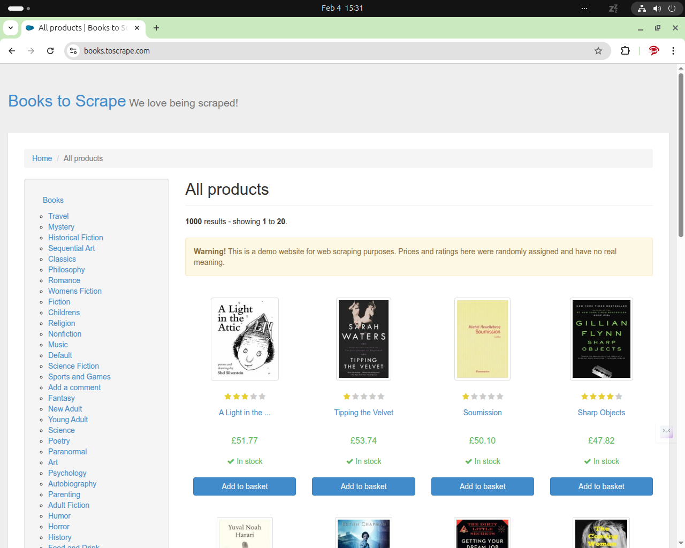
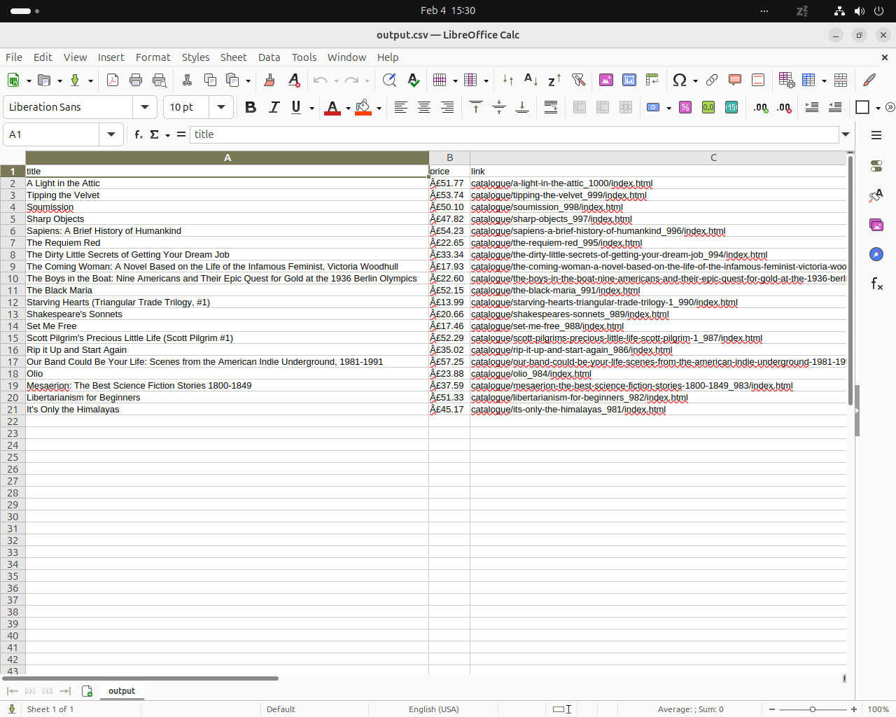

# Website to CSV Data Extractor (Python)

Extract website data and deliver it as clean, analysis-ready CSV files.

## Overview

This service uses a simple YAML configuration to collect repeating website items (title, price, link, etc.) and export structured rows to `output.csv`.

## Visual Schema

```text
+---------------------------+
| Target Website URL        |
+---------------------------+
             |
             v
+---------------------------+
| Config File (config.yaml) |
| URL + selectors + fields  |
+---------------------------+
             |
             v
+-------------------------------+
| website_to_csv_extractor.py   |
| fetch + parse + extract       |
+-------------------------------+
             |
             v
+---------------------------+
| Structured Output         |
| output.csv                |
+---------------------------+
```

## Requirements

- Python 3.8+
- `requests`
- `beautifulsoup4`
- `pyyaml`

## Installation

```bash
pip install -r requirements.txt
```

## Usage

### Quickstart

```bash
python website_to_csv_extractor.py
```

The script reads `config.yaml` and writes `output.csv` in the project directory.

## Input

- `config.yaml` with target page URL (`url`)
- Repeating item selector (`items_selector`)
- Requested field selectors (`fields`)

Example config:

```yaml
url: "https://books.toscrape.com/"
items_selector: "article.product_pod"
fields:
  title: "h3 a::attr(title)"
  price: ".price_color"
  link: "h3 a::attr(href)"
```

## Output

- `output.csv` with one row per matched item
- Column names based on `fields` keys in `config.yaml`

## Example

Demo source:

https://books.toscrape.com/

### Source Website



### Output CSV



## Use Cases

- Product catalog extraction
- Directory/listing exports
- Market or competitor snapshot datasets

## Notes

- Designed for public, mostly static websites.
- Login-protected pages, heavy JavaScript rendering, and anti-bot bypassing are out of scope for this script.
- `scraper.py` is kept as a compatibility wrapper and calls `website_to_csv_extractor.py`.

## License

MIT License. See `LICENSE`.
